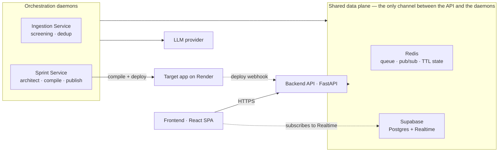

# upvote·dev

A community-driven feature voting portal where the roadmap is decided by votes and built by
agents. Members pitch a feature, the community upvotes it, and anything clearing the threshold is
screened, deduped, specified, compiled, and deployed with **no human in the loop** — then handed
back to the voters as a running app they can click.

Built for the [PromptDriven hackathon](https://promptdriven.ai/hackathon/61bd4739-4ae6-421c-8bb9-d61940e5243f).

> **The source of this project is prompts, not code.** The `.prompt` files under `prompts/` are
> compiled into the Python and TypeScript you run. A fresh clone has no `backend/`,
> `orchestrator/`, `frontend/`, or `shared/` directory until you generate them — see step 5.
> How that works, and how to change it, is in **[`prompts/README.md`](prompts/README.md)**.

## Architecture

Four running pieces plus two managed services. The Backend API and the orchestration daemons
**never call each other** — they meet only in Redis and Postgres, and only the daemons talk to an
LLM.



| Piece | Runs as | Role |
|---|---|---|
| Frontend | Vite dev server / static build | Board, ticker, submit and pitch-tracking modals, sandbox preview |
| Backend API | `uvicorn backend.main:app` | Pitch intake, voting, board reads, deploy webhook, Redis→Postgres event relay |
| Ingestion Service | `ingestion-service` daemon | Screens each pitch, dedups it, publishes survivors to the board |
| Sprint Service | `sprint-service` daemon | Picks top-voted features on a cadence, specs them, compiles and deploys |
| Redis | local or hosted | Intake queue, agent event pub/sub, unscreened pitches and rate counters under TTL |
| Supabase | managed | Postgres of record, plus Realtime as the only push path to the browser |

## Setup

### Prerequisites

- **Python ≥ 3.11** and [`uv`](https://docs.astral.sh/uv/)
- **Node ≥ 20** (frontend, once generated)
- **Redis** running locally, or a hosted URL
- A **Supabase** project (Postgres + Realtime)
- The **`pdd` CLI** — [promptdriven.ai](https://promptdriven.ai/) — for step 5

### 1. Install dependencies

```bash
uv sync
```

### 2. Create the database

Paste `schema.sql` into the Supabase dashboard → **Database → SQL Editor → New query → Run**.
It is idempotent, so re-running is safe.

### 3. Configure the environment

```bash
cp .env.example .env
```

`.env.example` documents every key, including optional tunables that fall back to defaults when
unset. The ones that most often trip people up:

| Key | Notes |
|---|---|
| `SUPABASE_URL`, `SUPABASE_SERVICE_KEY` | The **service-role** key — `schema.sql` relies on it bypassing RLS. The anon key is frontend-only. |
| `REDIS_URL` | e.g. `redis://localhost:6379` |
| `LLM_BASE_URL`, `LLM_API_KEY` | Used by the agents at runtime — separate from whatever `pdd` uses to generate code |
| `TARGET_PROMPT_DIR`, `COMPILE_COMMAND` | Where the target app's prompt lives and how to compile it |
| `RENDER_WEBHOOK_SECRET` | Shared secret authenticating the inbound deploy webhook |
| `SANDBOX_ALLOWED_HOSTS` | Allow-list for the preview iframe |
| `DEV_MODE` | `false` by default. When `true`, JWT verification is skipped and the caller id comes from an `X-Dev-User` header — spoofable by design, never enable in production. |

### 4. Start Redis

```bash
redis-server --appendonly yes
```

Append-only matters: Redis holds the only copy of a pitch between submission and screening.

### 5. Generate the code

Nothing runs until the prompts are compiled:

```bash
export PDD_COMMAND_MAX_OUTPUT_TOKENS=32000
pdd sync constants          # then each module in architecture.json priority order
```

Full instructions, ordering, and cost controls: **[`prompts/README.md`](prompts/README.md)**.

## Running the services

Three processes, each in its own terminal:

```bash
# Public API + deploy webhook  →  http://localhost:8000
uv run uvicorn backend.main:app --reload

# Screening + dedup daemon
uv run --env-file .env ingestion-service

# Cadence-driven build sprints
uv run --env-file .env sprint-service
```

Frontend:

```bash
cd frontend && npm install && npm run dev
```

The API must be reachable by the frontend, and both daemons need the same `.env` as the API — they
share Redis and Postgres. The daemons are independent of each other and of the API: you can run the
board with neither daemon up, and pitches will simply queue in Redis until the ingestion service
starts.

### Tests

```bash
uv run --group dev pytest            # Python
cd frontend && npm test              # Vitest
```

No test touches live infrastructure — Python uses `fakeredis` and a stubbed Supabase client, and
the frontend tests run against a stubbed `api_client`.

## Repository layout

| Path | What it is |
|---|---|
| `prompts/**` | **The source.** One `.prompt` per module — see `prompts/README.md` |
| `docs/user_stories/` | 15 user stories, the source of truth for behaviour |
| `docs/PRD.md`, `docs/tech_stack.md` | Scope and stack |
| `schema.sql` | Postgres schema — paste into Supabase |
| `architecture.json` | Module decomposition: paths, dependencies, build order |
| `.env.example` | Every configuration key, documented |
| `backend/` `orchestrator/` `frontend/` `shared/` | **Generated.** Created by step 5, not committed |
