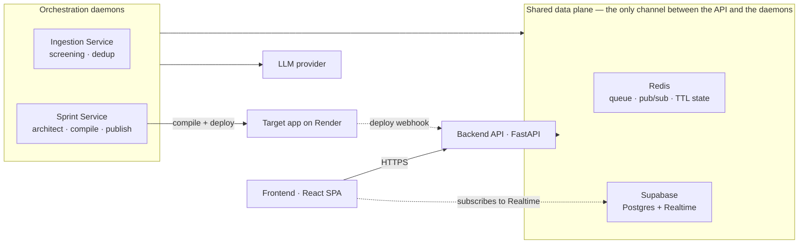

# upvote·dev

A community-driven feature voting portal where the roadmap is decided by votes and built by
agents. Members pitch a feature, which is first screened and deduped, then the community upvotes it, and anything clearing the threshold is evaluated, specified, compiled, and deployed with **no human in the loop** — then handed back to the voters as a running sandbox app they can click.

Built for the [PromptDriven hackathon](https://promptdriven.ai/hackathon/61bd4739-4ae6-421c-8bb9-d61940e5243f).

> **The source of this project is prompts, not code.** The `.prompt` files under `prompts/` are
> compiled into the Python and TypeScript you run. Codes under `backend/`,
> `orchestrator/`, `frontend/`, or `shared/` directory are example of artifacts from current prompts and should not be modified in place — see step 5.
> How that works, and how to change it, is in **[`prompts/README.md`](prompts/README.md)**.

## Architecture

Four running pieces plus two managed services. The Backend API and the orchestration daemons
**never call each other** — they meet only in Redis and Postgres, and only the daemons talk to an
LLM.



| Piece | Runs as | Role |
|---|---|---|
| Frontend | Vite dev server / static build | Board, ticker, submit and pitch-tracking modals, sandbox preview |
| Backend API | `uvicorn backend.main:app` | Pitch intake, voting, board reads, deploy webhook, Redis→Postgres event relay |
| Ingestion Service | `ingestion-service` daemon | Screens each pitch, dedups it, publishes survivors to the board |
| Sprint Service | `sprint-service` daemon | Picks top-voted features on a cadence, specs them, compiles and deploys |
| Redis | local or hosted | Intake queue, agent event pub/sub, unscreened pitches and rate counters under TTL |
| Supabase | managed | Postgres of record, plus Realtime as the only push path to the browser |

## Setup

### Prerequisites

- **Python ≥ 3.11** and [`uv`](https://docs.astral.sh/uv/)
- **Node ≥ 20** (frontend, once generated)
- **Redis** running locally, or a hosted URL
- A **Supabase** project (Postgres + Realtime)
- The **`pdd` CLI** — [promptdriven.ai](https://promptdriven.ai/) — for step 5

### 1. Install dependencies

```bash
uv sync
```

### 2. Create the database

Paste `schema.sql` into the Supabase dashboard → **Database → SQL Editor → New query → Run**.
It is idempotent, so re-running is safe.

### 3. Configure the environment

```bash
cp .env.example .env
```

`.env.example` documents every key, including optional tunables that fall back to defaults when
unset. The ones that most often trip people up:

**Required** — the app will not start without these:

| Key | Notes |
|---|---|
| `SUPABASE_URL`, `SUPABASE_SERVICE_KEY` | The **service-role** key — `schema.sql` relies on it bypassing RLS. The anon key is frontend-only. |
| `REDIS_URL` | e.g. `redis://localhost:6379` |
| `LLM_BASE_URL`, `LLM_API_KEY`, `TOKENROUTER_API_KEY` | Used by the agents at runtime — separate from whatever `pdd` uses to generate code |
| `TARGET_PROMPT_DIR`, `COMPILE_COMMAND` | Where the target app's prompt lives and how to compile it — see [Live testing](#live-testing) |
| `RENDER_WEBHOOK_SECRET` | Shared secret authenticating the inbound deploy webhook |
| `SANDBOX_ALLOWED_HOSTS` | Allow-list for the preview iframe |
| `FORUM_ORIGIN` | The frontend origin the API allows through CORS, e.g. `http://localhost:5173` |

**Optional** — everything below falls back to a sane default, but these are the ones you actually
reach for when running the pipeline live:

| Key | Default | Notes |
|---|---|---|
| `SPRINT_CADENCE_SECONDS` | `86400` (one day) | How often a sprint fires. Lower it to watch the pipeline — but see the warning in [Live testing](#live-testing), because two maintenance windows are derived from it. |
| `UPVOTE_THRESHOLD` | `10` | Votes a feature needs to be sprint-eligible. Unreachable in a short demo; lower it. |
| `PITCH_COIN_LIMIT` | `5` | Pitches one author may submit per UTC day. Raise it while testing intake. |
| `DEV_MODE` | `false` | When `true`, JWT verification is skipped and the caller id comes from an `X-Dev-User` header — spoofable by design, never enable in production. Needed to vote as more than one person. |
| `LLM_MODEL_SCREENING`, `LLM_MODEL_PM`, `LLM_MODEL_ARCHITECT` | per-role pins | Each agent's model is pinned separately, so you can put a cheap model on screening and a strong one on the architect. |
| `LLM_TIMEOUT_SECONDS`, `LLM_MAX_ATTEMPTS` | — | The ingestion daemon is serial, so a long timeout stalls the whole queue. |
| `SELF_API_BASE` | `http://127.0.0.1:8000` | Where the publisher posts the deploy webhook back to. Change it if the API is not on localhost. |
| `SANDBOX_URL` | `None` | A placeholder preview shown before the first real deploy exists. |
| `MAX_RETRIES` | `3` | Architect/compiler retries before a feature is archived. |
| `PENDING_PITCH_TTL_SECONDS` | `259200` (72h) | How long an author's pending/rejected pitch record survives in Redis. |

### 4. Start Redis

```bash
redis-server --appendonly yes
```

Append-only matters: Redis holds the only copy of a pitch between submission and screening.

### 5. Generate the code

Prompts are source; the code in `backend/`, `orchestrator/`, `shared/` and `frontend/src/` is
generated output. When a prompt changes, regenerate rather than hand-editing the file.

```bash
export PDD_COMMAND_MAX_OUTPUT_TOKENS=32000
pdd --local --force --estimate generate <prompt> --output <file>   # price it first
pdd --local --force generate <prompt> --output <file>              # then run it
```

**pdd runs locally against TokenRouter.** Four things about that setup are not obvious:

- **Models live in `~/.pdd/llm_model.csv`, not in environment variables.** `PDD_MODEL` and
  `PDD_PROVIDER` are ignored unless a matching row exists. Ids look like
  `openai/anthropic/claude-opus-4.6` because routing goes through TokenRouter's OpenAI-compatible
  transport, and `base_url` comes from that CSV — `TOKENROUTER_BASE_URL` in `.env` is unused.
- **`TOKENROUTER_API_KEY` is the credential every row names.** pdd resolves `.env` relative to its
  own working directory, so a command run outside this repo finds no key and fails with
  `All candidate models failed`. Anything that shells out to pdd must inject it explicitly —
  `orchestrator/publisher.py` and `orchestrator/compiler.py` both do.
- **`export PDD_COMMAND_MAX_OUTPUT_TOKENS=32000` is required.** Unset, pdd sends no `max_tokens`
  and inherits the provider ceiling, truncating long output mid-file. Despite the name it *raises*
  the cap.
- **Prefer `generate` over `sync`.** `sync` adds example generation, test generation, verification
  and a fix loop — `.pddrc` scopes it to a $10 budget per invocation, roughly 200× a single
  `generate`. This project generates, then writes tests by hand (Claude) in the interest of budget and speed

Known failures specific to TokenRouter, and how to work around each:
**[`docs/pdd-prompt-authoring.md`](docs/pdd-prompt-authoring.md#known-issues-tokenrouter)**.
Ordering and cost controls: **[`prompts/README.md`](prompts/README.md)**.

## Running the services

Three processes, each in its own terminal:

```bash
# Public API + deploy webhook  →  http://localhost:8000
uv run uvicorn backend.main:app --reload

# Screening + dedup daemon
uv run --env-file .env ingestion-service

# Cadence-driven build sprints
uv run --env-file .env sprint-service
```

Frontend:

```bash
cd frontend && npm install && npm run dev
```

The API must be reachable by the frontend, and both daemons need the same `.env` as the API — they
share Redis and Postgres. The daemons are independent of each other and of the API: you can run the
board with neither daemon up, and pitches will simply queue in Redis until the ingestion service
starts.

## Live testing

Running the loop for real — a pitch typed into the UI, screened, voted over the threshold, and
compiled by a sprint that fires on its own timer — rather than developing your test script to directly bypass the cadence entirely.

### What the target app has to provide

The pipeline compiles a **separate** app; it does not modify itself. `TARGET_PROMPT_DIR` points at
that project's checkout.

**Use [`weicc21/streaks-demo`](https://github.com/weicc21/streaks-demo) as the boilerplate.** It is
the target this project was built against, so it already has the prompt file, the compile setup, and
the `deploy.sh` contract in the shape the orchestrator expects. Fork it and replace the app's own
prompt with yours rather than assembling a target from scratch.

Whatever you point at has to satisfy three things:

1. **A prompt file whose name the orchestrator expects.** The blueprint path is resolved as
   `${TARGET_PROMPT_DIR}/streaks_demo_typescriptreact.prompt`, and that filename is a module
   constant (`_BLUEPRINT_FILENAME` in `orchestrator/architect.py`), **not** an env key. To point the
   pipeline at your own app you either name its prompt exactly that, or change the filename in
   `prompts/orchestration/architect_python.prompt` and regenerate. The directory is configurable;
   the filename is not.
2. **A `COMPILE_COMMAND` naming your prompt and its output.** For this target:

   ```
   COMPILE_COMMAND="pdd --local --force generate streaks_demo_typescriptreact.prompt --output streaks_demo.tsx"
   ```

   `--force` matters: without it pdd asks `Overwrite existing files?` and, with no TTY, hangs rather
   than failing. `generate` rather than `sync` keeps a compile at cents instead of the `$10` budget
   `.pddrc` scopes `sync` to. The compiler injects `PDD_COMMAND_MAX_OUTPUT_TOKENS` and
   `TOKENROUTER_API_KEY` into the subprocess itself, so neither needs to be exported in the
   orchestrator's shell — pdd resolves `.env` from *its own* working directory, which is the target
   repo, and that repo has no `.env`.
3. **A `deploy.sh` honouring `SKIP_COMPILE` and `SKIP_PUSH`.** The publisher invokes the target
   repo's own script with `SKIP_COMPILE=1` (the compiler already produced the source) and strips
   `SKIP_PUSH` from the child environment so a daemon launched from a shell that exported it still
   pushes. Commit-and-push logic stays in the target project rather than being duplicated here.

The blueprint is also the **only authority on what conflicts**: the architect judges every pitch
against it, both at intake and again at sprint time. A missing or empty file raises rather than
defaulting — deliberately, because judging friction against nothing green-lights every feature.

### Settings for a session you can actually watch

```bash
SPRINT_CADENCE_SECONDS=600     # 10 minutes
UPVOTE_THRESHOLD=2             # reachable with two identities
PITCH_COIN_LIMIT=20            # room to try several pitches
DEV_MODE=true                  # lets you vote as more than one person
```

**Do not set the cadence too low.** Two maintenance windows are derived from it, not configured
separately:

```python
_ROLLBACK_WINDOW_SECONDS = 2 * SPRINT_CADENCE_SECONDS
_DECAY_WINDOW_SECONDS    = 7 * SPRINT_CADENCE_SECONDS
```

At a 120-second cadence that means `IN_SPRINT` features roll back to `VOTING` after four minutes and
below-threshold `VOTING` features are archived after fourteen. A target-app compile can easily take
longer than four minutes, so the next sprint would roll a feature back while its own compile is
still running. Ten minutes gives a 20-minute rollback window and a ~70-minute decay window, which is
comfortable. Neither window has its own env key — the only lever is the cadence.

### Expect these

- **You need more than one identity to cross the threshold.** `unique (feature_id, user_id)` means
  one browser is one vote. With `DEV_MODE=true`, send a different `X-Dev-User` UUID per vote.
- **One feature per sprint.** Capacity is a module-local constant of 1, so a cycle promotes the
  single highest-voted eligible feature and no more.
- **An empty sprint is normal.** Nothing eligible returns an outcome recording that it ran; it is
  not an error and not a failure to investigate.
- **Watch the logs, not the board.** Every transition is logged with the feature id and reason at
  info level; on a quiet cycle the board simply does not change.
- **Screening and dedup cost two LLM calls per pitch** and the ingestion daemon is serial, so a
  pitch takes roughly half a minute to appear and pitches queue behind each other.

### Without Render wired up

The compile runs and writes source into the target repo, but the feature **stays `IN_SPRINT`** — the
deploy webhook owns the `IN_SPRINT` → `COMPILED` transition, so with nothing pushing and nothing
deploying, that transition never fires. The board correctly shows "AI Building" rather than claiming
a build is live. Set `SANDBOX_URL` to give the preview pane something to display in the meantime.

### Unit Tests

```bash
uv run --group dev pytest            # Python
cd frontend && npm test              # Vitest
```

No test touches live infrastructure — Python uses `fakeredis` and a stubbed Supabase client, and
the frontend tests run against a stubbed `api_client`.

## Repository layout

| Path | What it is |
|---|---|
| `prompts/**` | **The source.** One `.prompt` per module — see `prompts/README.md` |
| `docs/user_stories/` | 16 user stories, the source of truth for behaviour |
| `docs/PRD.md`, `docs/tech_stack.md` | Scope and stack |
| `schema.sql` | Postgres schema — paste into Supabase |
| `architecture.json` | Module decomposition: paths, dependencies, build order |
| `.env.example` | Every configuration key, documented |
| `backend/` `orchestrator/` `frontend/` `shared/` | **Generated.** Created by step 5 |
